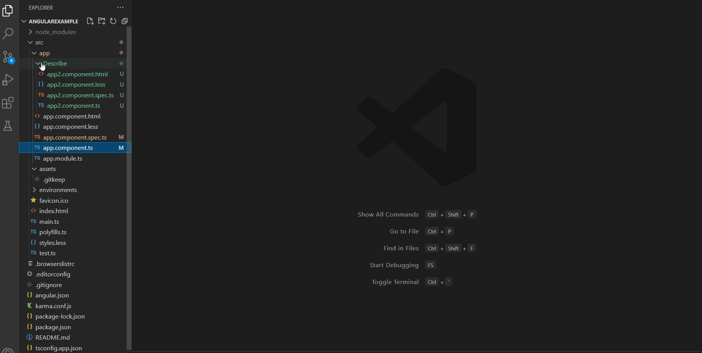
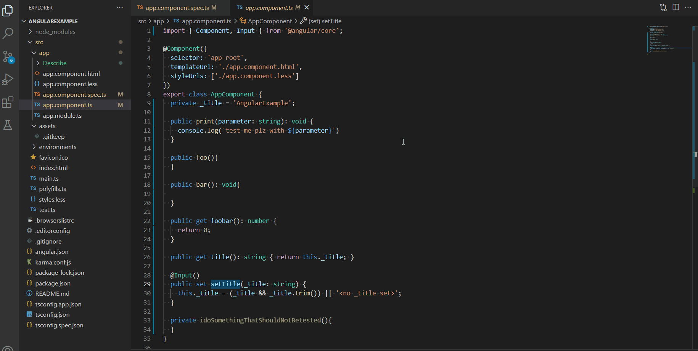
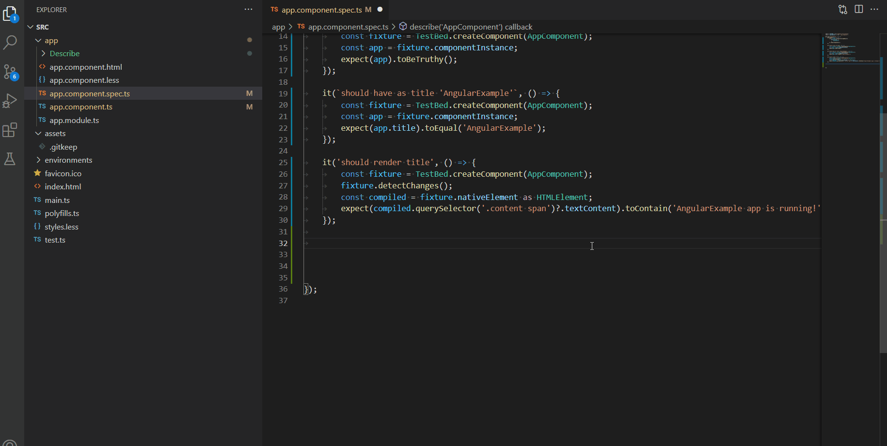

# Jasmine test template generator README

This extension gives you the ability to generate [Jasmine](https://jasmine.github.io/) test cases by a single click.
 
Removing the need for redundant copy paste and increasing efficiency when generating unit tests.

Below is a small demo about it's 3 main usages.

1- To generate single method unit test declaration by clicking on wanted method to test:


2- To generate all public method declarations by clicking on file: 


3- To add code snippets for manual unit test writing with keywords such as "de, describe, create":


## Features

Currently supports 2 jasmine Syntax.

1- Using "it" nested inside parent Describe as build by the angular-cli template component generator.

```
describe("Component", () => {
  ...
  it('should create the app', () => {
    const fixture = TestBed.createComponent(AppComponent);
    const app = fixture.componentInstance;
    expect(app).toBeTruthy();
  });

});
```
2- Using nested Describe inside parent Describe for every public method declarations.
```
describe("Component", () => {
  ...
  describe("ctor", () => {
	  it('should create the app', () => {
	    const fixture = TestBed.createComponent(AppComponent);
	    const app = fixture.componentInstance;
	    expect(app).toBeTruthy();
	  });
  });
});
```
- If there is a mix of jasmine syntax already in spec.ts file. 
The nested describe syntax will be the one use as base template for future test generation.

## Requirements

Must have VS Code version 1.57.0 or higher.

## Known Issues

- If there is no "it" or "describe" test already present in the spec.ts file than the template generation will fail.
Normally the constructor test should always be present and serve as the guideline. 


## Release Notes

Users appreciate release notes as you update your extension.

### 1.0.0

Initial release of Test template generator 

## Limitations
- Only typescript language is supported right now for test generation.
- If there is no "it" or "describe" test already present in the spec.ts file than the template generation will fail. 
Normally the constructor test should always be present and serve as the guideline.


##  Releases
 See the [changelog](CHANGELOG.md).